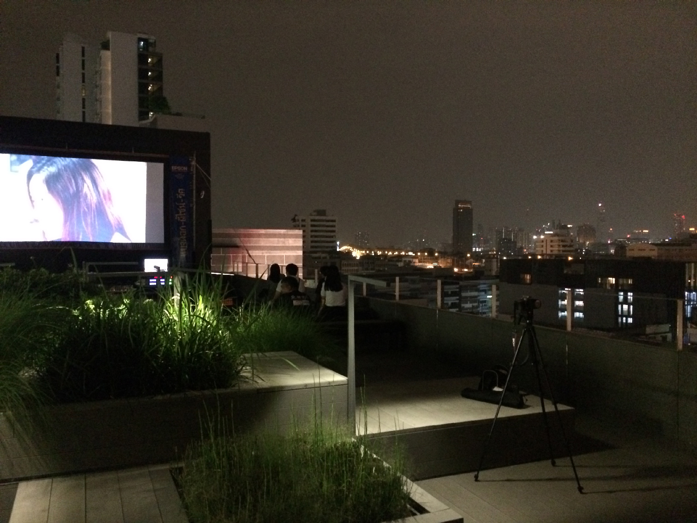
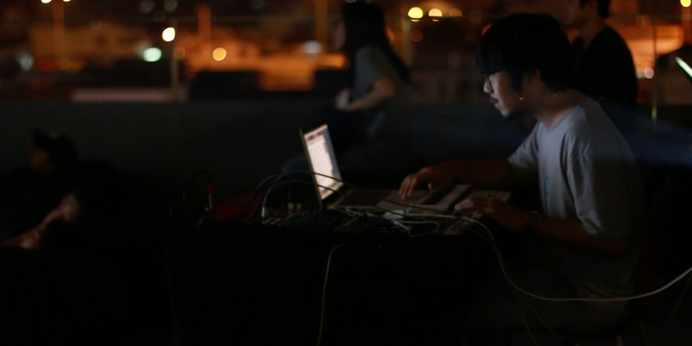
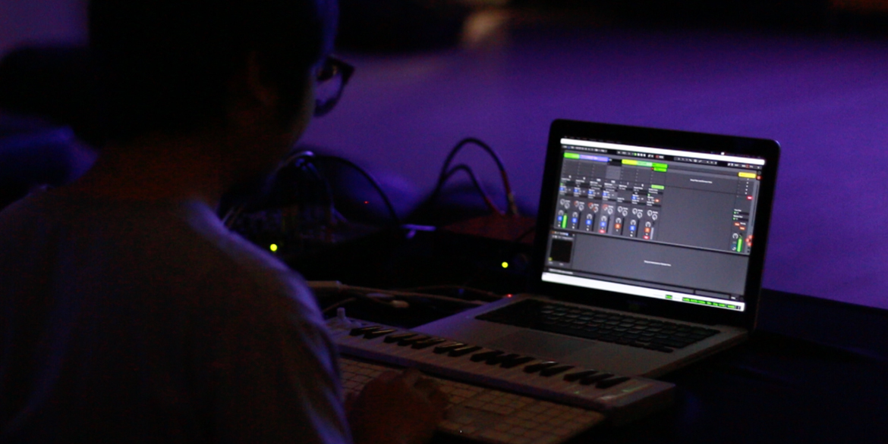
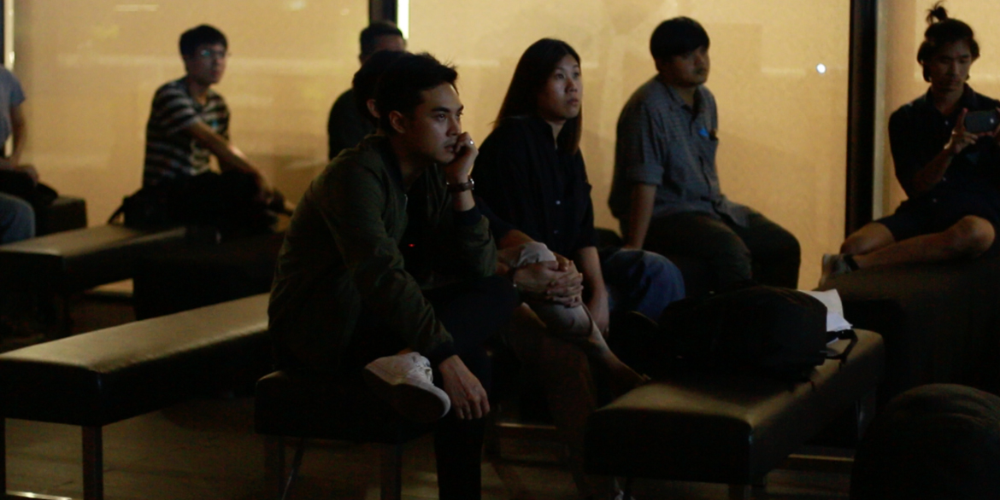

# What.

Live-coding performance for Bangkok Design Week'18 at [TCDC](https://web.tcdc.or.th/th) (Thailand Creative Design Center's building) rooftop 5th fl.
 
 
sound is generated by manipulating Haskell-based code called [TidalCycles](https://tidalcycles.org/index.php/Welcome)
mangled with real-time `GLSL` code using [VEDA](https://veda.gl/), and GLSL framework in Atom background, 
route back to [Ableton](https://www.ableton.com/en/) for the sake of final composition.

------
# Learn.

- generates sound with [TidalCycles](https://tidalcycles.org/index.php/Welcome).
- access through GPC by using GLSL language, in this case [VEDA](https://veda.gl/).
- communicate to each others via [ OSC ](http://opensoundcontrol.org/introduction-osc)  (Open Sound Control).

------

### Useful Links
- [Demo](https://vue-markdown-blog.netlify.com)
