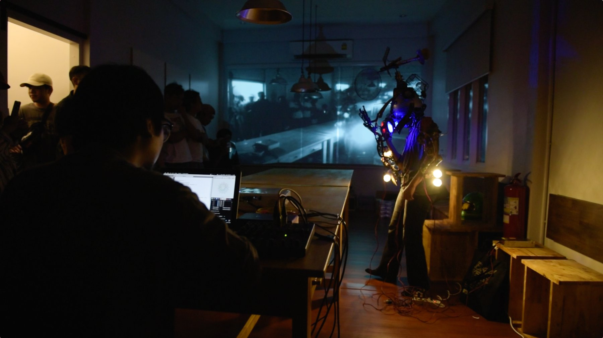
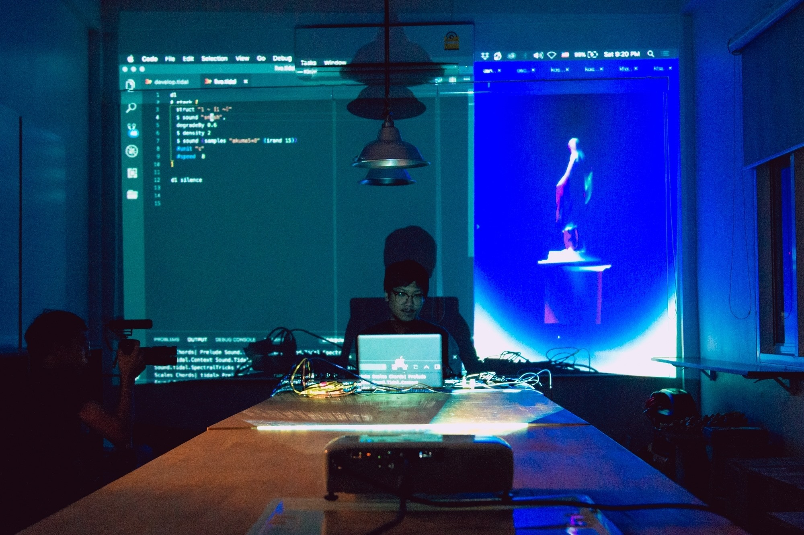
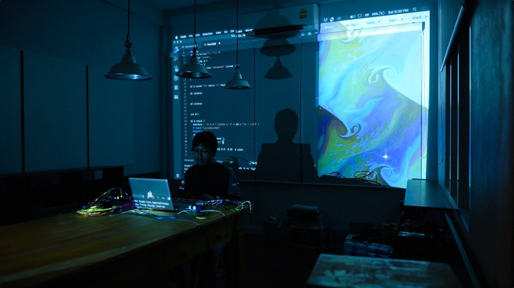

# What.

first part is a live performance with Wilawan Wiangthong, and Warangkhana Prasertphol, 
tell a concept about transitional state of identity, mechanical embodiment, and dystopian future.

second part is live-coding via TidalCycles, Veda, Ableton.

------

# How.

first part (with performance artists) using SuperCollider as sound engine, when the harmonies fluctuate between dissonant and consonance, pattern generated via IanniX.

------
# Learn.

- [IanniX](https://www.iannix.org/en/), graphical sequencer.
