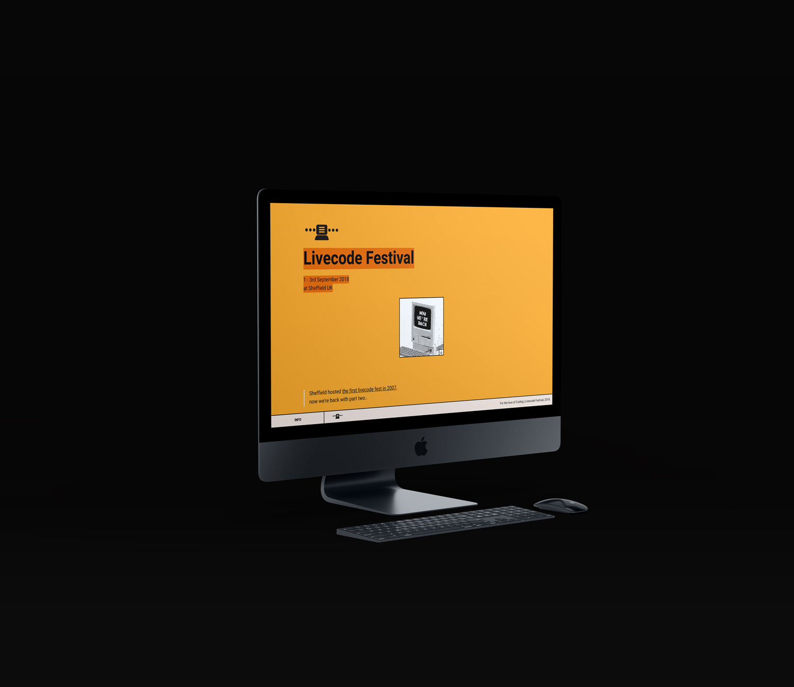
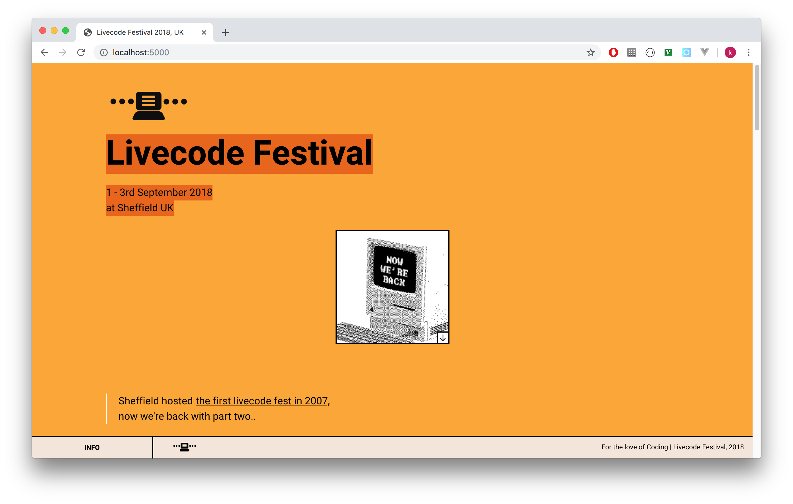
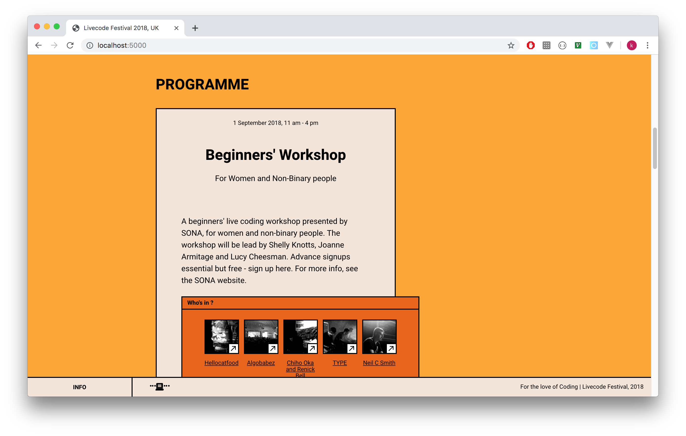
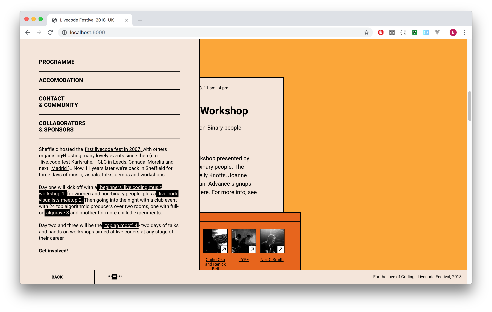

# What.
Livecode festival is algorithmic music festival, held in England,
the former design is only orange texts with plain white background.
this design picked up key element like color organized them systematically
with a quick glance it’s look not much change, 
but, eventually this design is never being used due to technical issue.

------

# Why.

( waiting...)

------

# How.

( waiting...)

------
# Learn.

(waiting..)

------
# Caveats.
(waiting..)

------
# Notes.

(waiting..)

---

### Useful Links
- [Demo](https://vue-markdown-blog.netlify.com)
- [Project Repository](https://github.com/josephharveyangeles/vue-markdown-blog)
- [Dynamic Components](https://vuejs.org/v2/guide/components-dynamic-async.html#Async-Components)
- [vue-cli webpack guide](https://cli.vuejs.org/guide/webpack.html#simple-configuration)
- [vue-markdown-loader](https://github.com/QingWei-Li/vue-markdown-loader)
- [Working with CSS Modules](https://cli.vuejs.org/guide/css.html#postcss)
- [Markdown styles](http://markedstyle.com/styles)
