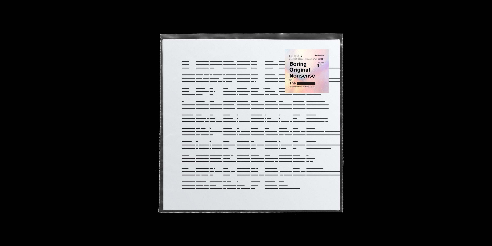
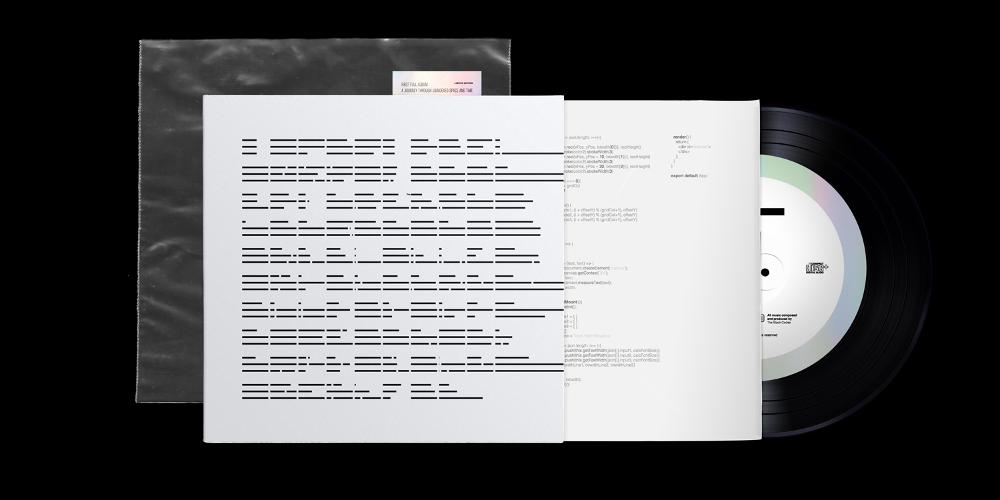
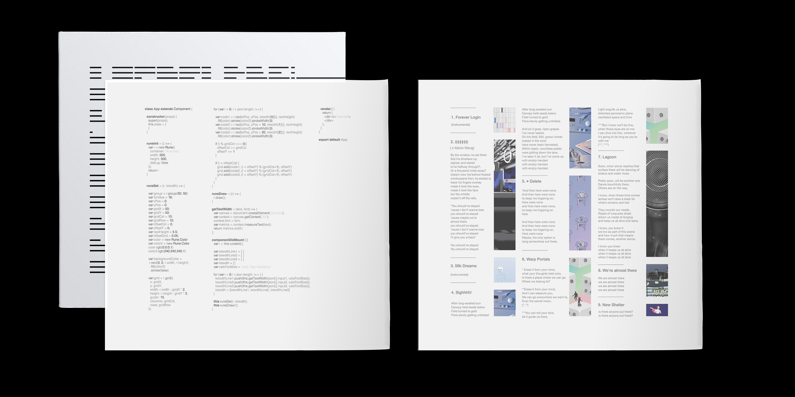
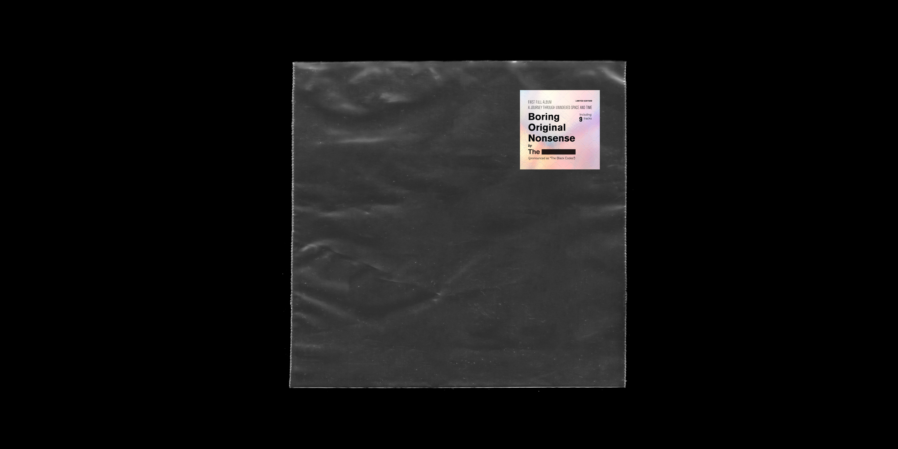
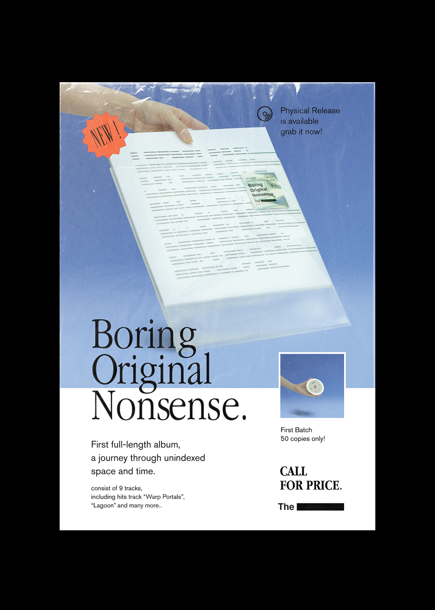

# What.

Boring Original Nonsense is first full length album from The Black Codes, the term "Boring Original Nonsense" demonstrates methodology on suspecting and questioning “Originality” in modern world and contexts which inevitably for music and design (or art-related works), its fluidity becomes more noticeable and the line between one side and the others has been blurred, thus, it had simultaneously teared down a huge mental blocks and weave music and design together. 

reflecting on the cover artwork, by collecting data from audiences and interpreted as codes using `Firebase` integrated with JavaScript library `Rune.js`, input dataset were collected and calculated to provide lengths for “Black bar” relevant to The Black Codes’s logo. 

start collecting data dates from 15/11/2017 - 15/12/2017 total 98 audiences’ dataset, the grid system was built around incoming dataset. back cover, sleeve, and website were arranged respectively according to the grid system. 

------
------

# Why.

(waiting..)

------
------

# How.

(waiting..)

------
------
# Learn.

(waiting..)

------
------
# Caveats.
(waiting..)

------
------
# Notes.

(waiting..)

---

### Useful Links
- [Demo](https://vue-markdown-blog.netlify.com)
- [Project Repository](https://github.com/josephharveyangeles/vue-markdown-blog)
- [Dynamic Components](https://vuejs.org/v2/guide/components-dynamic-async.html#Async-Components)
- [vue-cli webpack guide](https://cli.vuejs.org/guide/webpack.html#simple-configuration)
- [vue-markdown-loader](https://github.com/QingWei-Li/vue-markdown-loader)
- [Working with CSS Modules](https://cli.vuejs.org/guide/css.html#postcss)
- [Markdown styles](http://markedstyle.com/styles)
