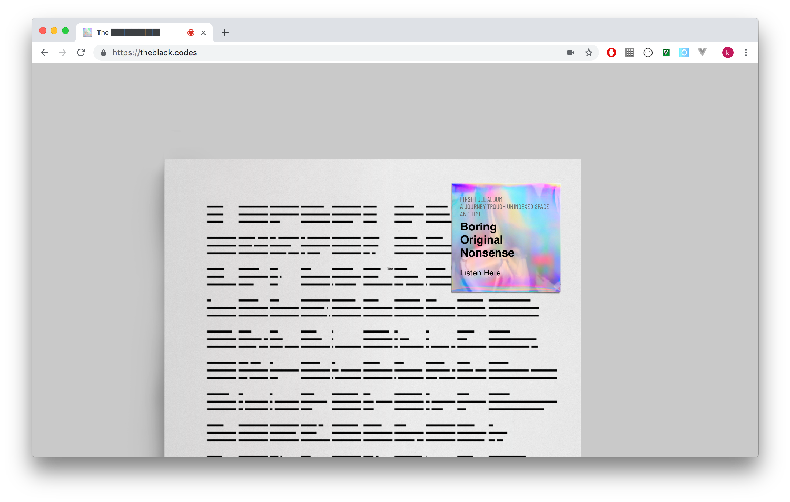
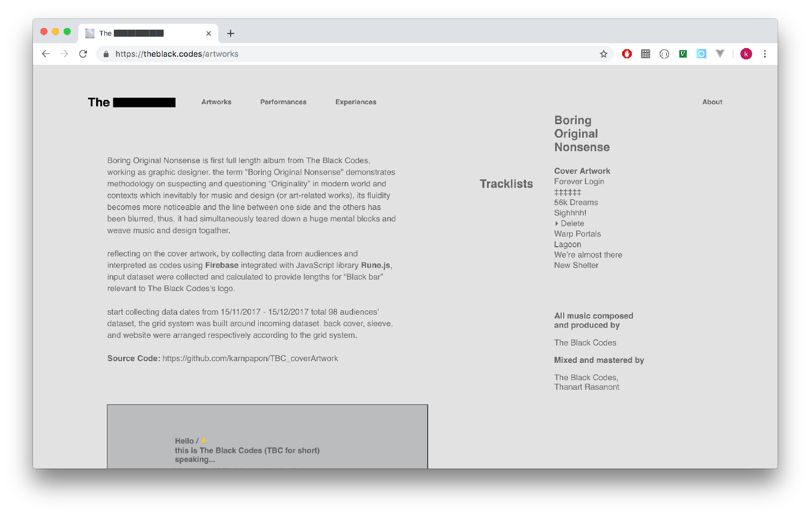
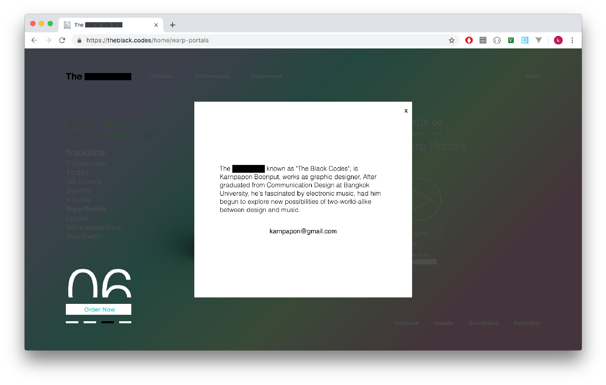

# What.

The Black Codes is an electronic bangkok-based musical act, consists of Karnpapon Boonput. 
the website intended to be a part of promoting the first album “Boring Original Nonsense” ( 2018, self-released).
the website is simply SPA (Single-page application) meets minimal design.
distorted reflection via webcam in the first page simulates the physical release where the holographic sticker was pasted on the transparent plastic cover.

all the music and lyrics artworks, are available on the website.

------

# Why.

this website intended to be a part of promoting first album “Boring Original Nonsense” ( 2018, self-released).

------

# How.

ReactJS as UI engine.
vedaJS as webGL ( manipulated input camera ).

------
# Learn.

since this is my first experience in web development
I’ve leaned a lot from this project from scratch.
obviously, the code is not as intuitive.

---

### Useful Links
- [Demo](https://vue-markdown-blog.netlify.com)
