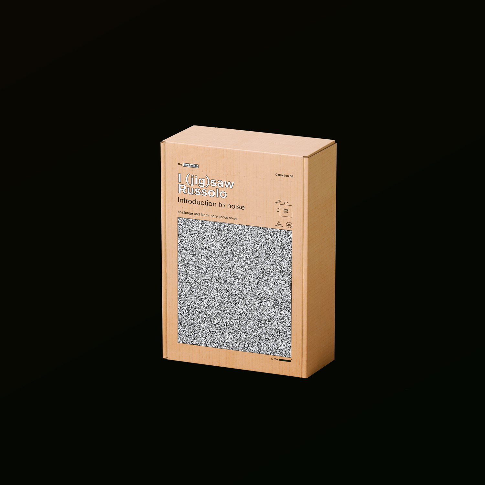
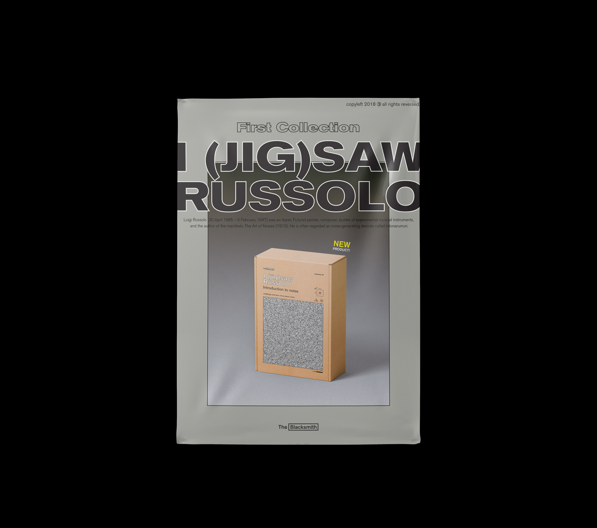
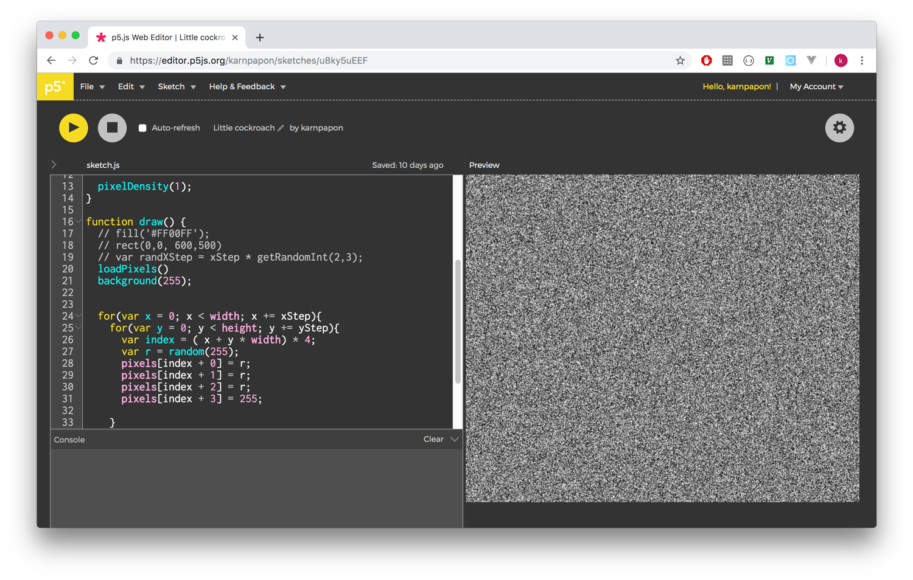
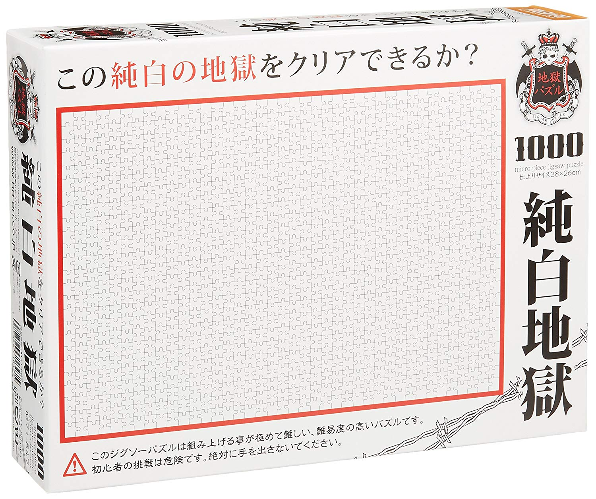

# What.

The Blacksmith is branched from The Black Codes, as merchandise and fun-and-silly-thing stuff with the first product “I (saw) Russolo”, a jigsaw with noise pattern 
inspired from white jigsaw puzzle
 

<small>credit: https://www.amazon.com/Beverly-Micro-White-Jigsaw-Puzzle/dp/B008DCQE3O</small>
 
 
this jigsaw will blur the line between the hardest and the easiest, entertainment and cumbersome, finish it or fuck it!

------
------

# Why.

I was asked to join flea market event at DE COMMUNE, a famous live-house in Bangkok with wide-range of genre performance. this is the first product came into my mind as a funny project, but i found it really encourage me to think outside of the box.

------
------

# How.
noise pattern is generated by P5.js.
the package is silkscreened by hands.

------
------
# Learn.

- [P5.js](https://p5js.org/) as noise pattern generator.

------
------

---

### Useful Links
- [Demo](https://editor.p5js.org/karnpapon/sketches/u8ky5uEEF)
