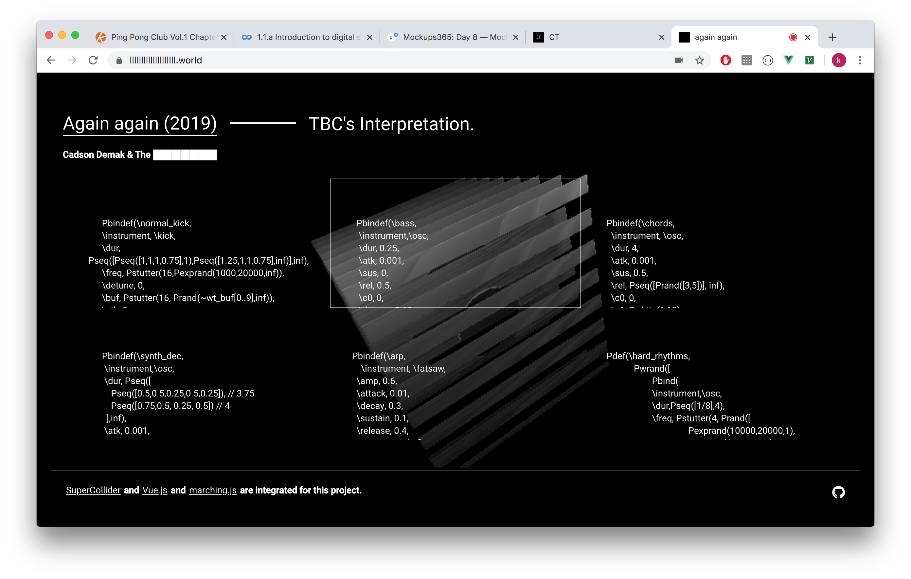

# What

I was commissioned to remix the song called [ "อย่างเสียใจ ( again again)" ](https://www.youtube.com/watch?v=s6216p1ANpU)  
by [ Cadson Demak Record ](https://www.facebook.com/cadsondemakrecords/),
part of [ Cadson Demak ](https://cadsondemak.com/home/), a business to business service based in Bangkok, Thailand. 
 
 
Decided to use SuperCollider for audio synthesis and algorithmic composition  
to intepret an unique story, this website is part of song promo. 
Demonstrate the song structure and let audience play with composition with thier own wills.

> <a href="https://againagain.netlify.app" target="_blank">play here</a>

------

# How

an audio is passed through Tone.js, visualized by Marching.js, Ray-marching library.

------
# Learn

- [SuperCollider](https://supercollider.github.io/) audio synthesis, algorithmic composition.
- [Tone.js](https://tonejs.github.io/) audio playback.
- [Marching.js](https://github.com/charlieroberts/marching) visuallizer.
