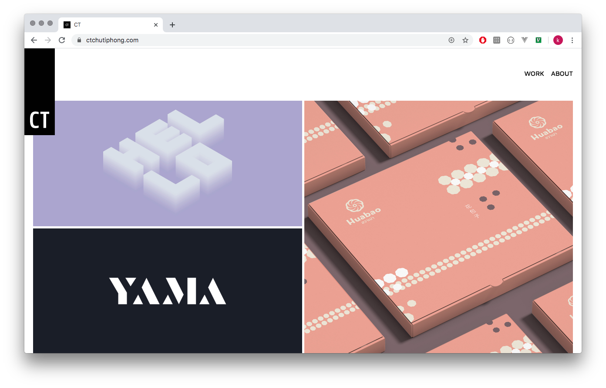

# What

Website for CT Design, an independent design firm based in Bangkok, Thailand

------

# Why
CT is a design studio, 
creating communication design such as brand identity, packaging design, illustration and print.

------

# How

Gatsby as UI engine.  
Contentful as a Content Management System (CMS)
Netlify as a hosting.

------
# Learn.

- [Gatsby.js](https://www.gatsbyjs.org/) as view-engine.
- [Contentful](https://www.contentful.com/) as a Content Management System (CMS).
- [Netlify](https://www.netlify.com/) as a hosting.
