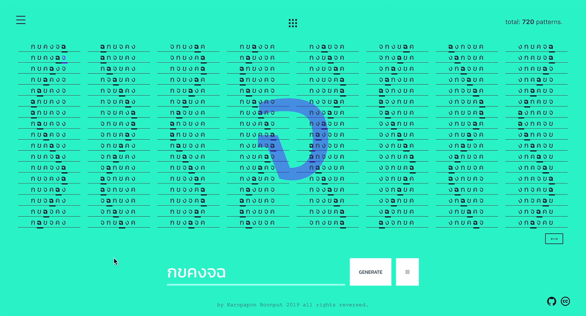

# What.

implementation on SJT ( Steinhaus-Johnson-Trotter's) algorithm for thai characters as a musical pattern sequencer. since letter contains an array of properties, one of the property is "Phonetic", in short, Phonetic of each individual letter determines how to produce a sound. thus, phonetic is picked up and using to determine an "envelope" for each particular synth voice.   

eg. letter "p" has percussive sound, then `attack = 0.01` ( in terms of tone.js ) letter "y" has a smooth attack,so ` attack = 0.5` and so on.

------
------

# Why.

inspired from word-playing where little permutation gives rhythmic sense.

------
------

# How.

VueJS as UI engine.  
Tone.js as Synth engine.

------
------
# Learn.

- [Vue.js](https://vuejs.org/) as view-engine.
- handle state-management by [Vuex.js](https://vuex.vuejs.org/).
- [Tone.js](https://tonejs.github.io/) as audio engine.

------
------
# Caveats.
(waiting..)

------
------
# Notes.

(waiting..)

---

### Useful Links
- [Demo](https://vue-markdown-blog.netlify.com)

