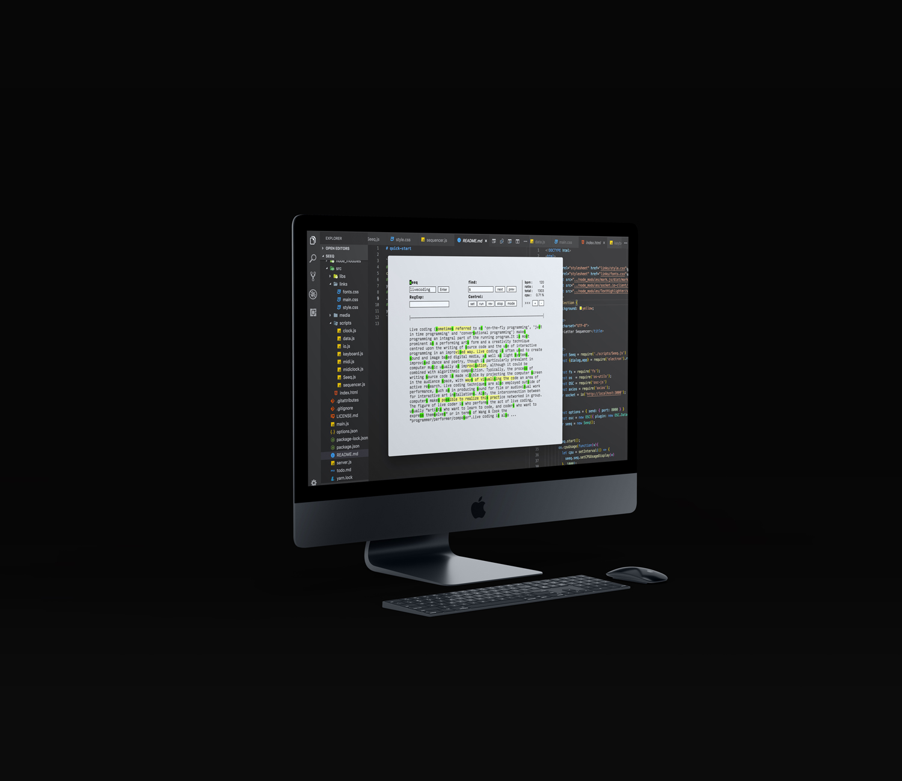
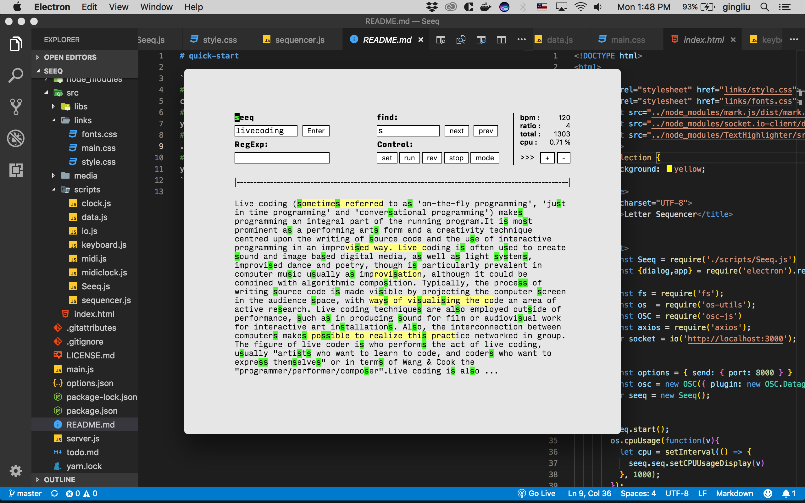
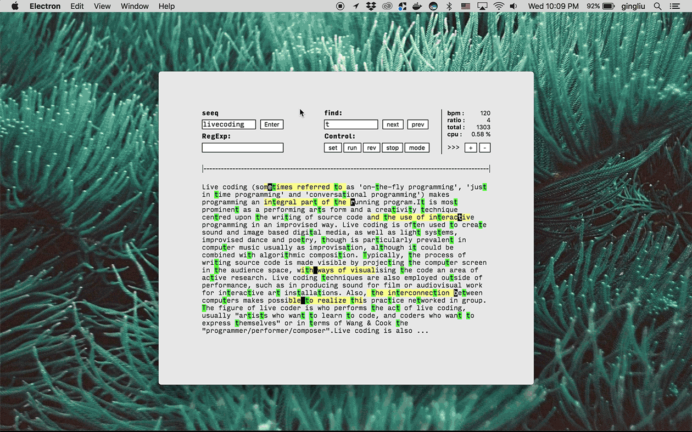

# What.

a custom sequencer, draw an inspiration from String’s description
> "String is  traditionally <br> a sequence of letters”.

to play with it, just put any words, sentences, just like searching from Google or any search engine. Seeq will manage to find the descriptions for that keywords and use it as a step sequencer (using API from WikiPedia).
a “trigger” is simply assigned by typing any words/letters in provided input, Regex is also available. and hits run. 
currently support only sending MIDI out.
below are basic operators.

```
delete pattern ( keystroke = 'X').
reverse pattern ( keystroke = 'R')
mute ( keystroke = 'M').
sending MIDI msg ( keystroke = 'I').
increase BPM = ( keystroke = '>').
decrease BPM = ( keystroke = '<')
```

<b><a href="https://www.youtube.com/watch?v=DGaakhSvYOg" target="_blank">click to watch in action!</a></b>

------
------

# Why.

sequencer/sequencing is common in electronic music scene.
most of music making process were constructed from rhythm — to be more precise, it’s periodic sets of interval. thus, fundamental is inevitable.
DOM manipulation is fundamental for every web development process.
this draw me back to fundamentally understanding and face it squarely, without any UI library or anything apart from Electron. 
since I started learning JavaScript via React,  this is a kind of the demystified-JavaScript’s learning process. and encourages myself to learn more about Regex’s Pattern as well.

------
------

# How.

 Seeq is powered by Electron, JavaScript’s framework for cross-platform application. wrote with object-oriented paradigm.

------
------
# Learn.


- [Electron.js](https://electronjs.org/), since it has such a huge overhead. that being said, only “Hello world” your application’s size can ridiculously takes around ~100mb.
- raw DOM manipulation.
- OOP (Object-Oriented Programming) in JavaScript.
- MIDIAccess in WebAPI.

------
------
# Caveats.
 Seeq relied on external DAW/software to send MIDI to, 
 it’d be great to have it’s own internal synth
 also it’s still unstable, and buggy.

------
------
# Notes.

bigs up for an Orca, live coding environment, for inspirations.

---


### Useful Links
- [Electron.js](https://electronjs.org/)
- [MIDIAccess](https://developer.mozilla.org/en-US/docs/Web/API/MIDIAccess)
- [OOP in JavaScript](https://medium.freecodecamp.org/an-introduction-to-object-oriented-programming-in-javascript-8900124e316a)

