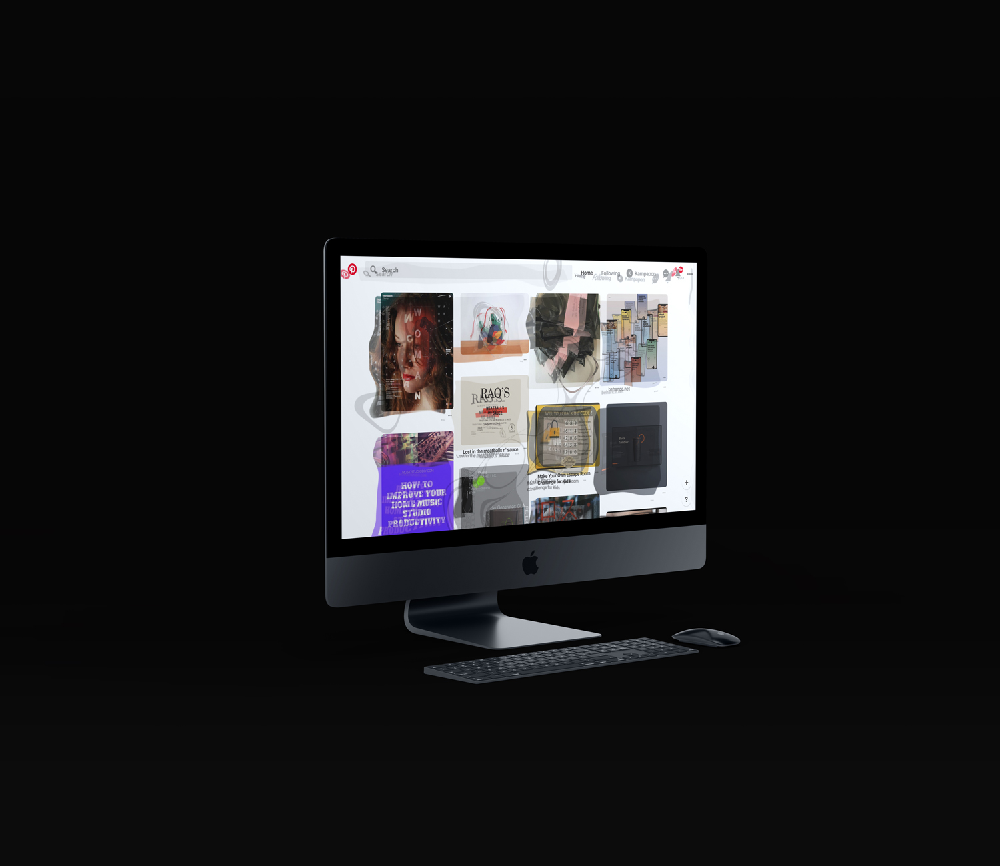

# What.
Chrome’s Extension to simulate Songkran festival through sight and sound without any VR’s equipment needed!, for those who wanted to *feels*  like participating in one of the most famous festival in Thailand, where people prompt to pour water on each others, 

<small>credit: https://thethaiger.com/thai-life/songkran-survival-guide-top-10-tips</small>

the period where the heat’s at its peak of the year and embedded-sub-woofer-car-sound-system’s culture are commonly heard.

------
------

# Why.

when wanted to feels like participating in the festival but not to get wet.

------
------

# How.
using vedaJS as webGL.
web audio as audio processing.

------
------
# Learn.

my initial idea is to capturing audio from non-active tab and render webGL to current active tab, eg. sound from YouTube and visual from Pinterest. but afaik non-active tab can’t be captured due to security restriction, sadly currently have no workaround.

------
------
# Caveats.

audio capturing is not stop when refreshing, only stop when close the tab.

------
------
# Notes.

inspired from Amagi Takayosi’s work.

---

### Useful Links
- [Demo](https://vue-markdown-blog.netlify.com)
- [Project Repository](https://github.com/josephharveyangeles/vue-markdown-blog)
- [Dynamic Components](https://vuejs.org/v2/guide/components-dynamic-async.html#Async-Components)
- [vue-cli webpack guide](https://cli.vuejs.org/guide/webpack.html#simple-configuration)
- [vue-markdown-loader](https://github.com/QingWei-Li/vue-markdown-loader)
- [Working with CSS Modules](https://cli.vuejs.org/guide/css.html#postcss)
- [Markdown styles](http://markedstyle.com/styles)
