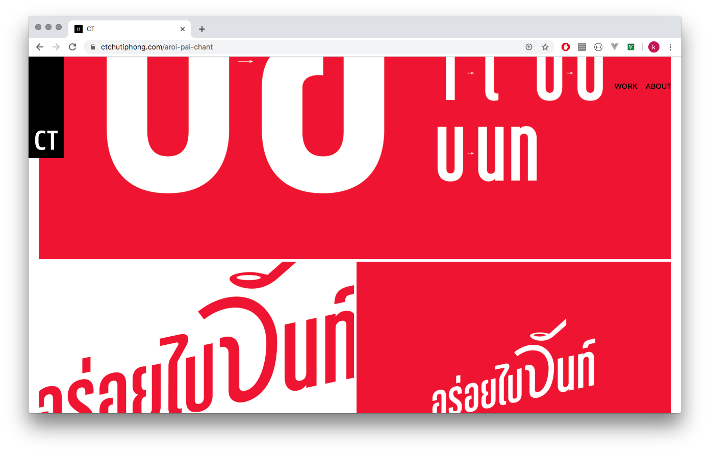

# What.

เสียง ( \siang\ ) means "sound" in Thai language.
audio music player written in Rust programming language.

------

# Why.
-

------

# How.

Rust   

------
# Learn.

- [Rust](https://www.rust-lang.org/) programming language.
