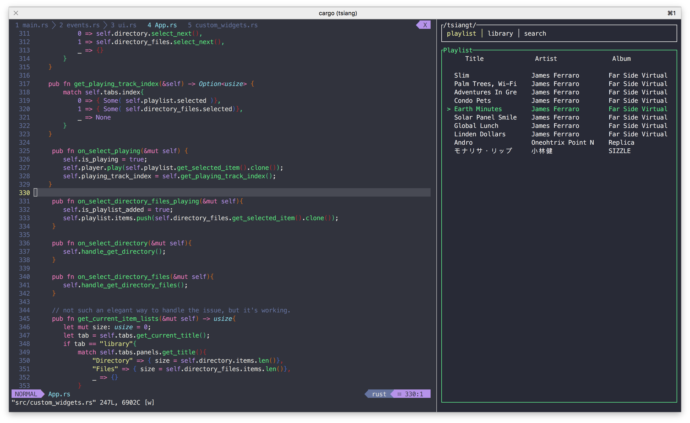

# What

เสียง ( \siang\ ) means "sound" in Thai language.  
audio music player written in Rust programming language.  
with basic features eg. add song / play / pause  
more informations can be found [here](https://github.com/karnpapon/tsiangt).

------

# Why
seamlessly workflow for Vim user   
( eg. up / down / left / right as 'k' , 'j' , 'l' , 'h' respectively).  
and to learn new programming language and paradigms.

------

# How

written in Rust, system programming language 
an audio is passed to Rodio, a Rust audio playback library.
using Tui as an Interface.

------
# Learn

- [Rust](https://www.rust-lang.org/) programming language.
- [Rodio](https://github.com/RustAudio/rodio) an audio playback.
- [Tui](https://github.com/fdehau/tui-rs) Terminal Interface.
- [Termion](https://github.com/redox-os/termion) Terminal backend.
