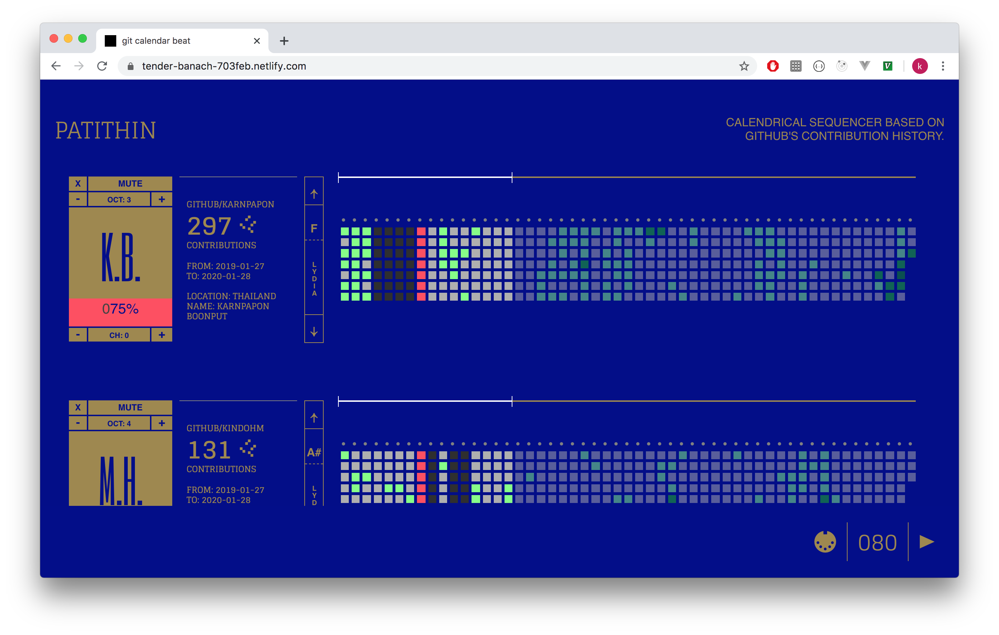

# What

calendrical sequencer based on Github's contribution history.
where velocity of the note is determined by commit's frequency. 
total 53 weeks, the only way to assign trigger is just commit!.

<iframe width="420" height="315"
src="https://www.youtube.com/embed/0MEqRyrv7BA">
</iframe>

### features

- MIDI protocol (out only)
- Internal Synth voice (13 instruments) 
- adjustable
    - steps length.
    - scale / root note.
    - pitch.
    - midi-channel.
    - volumn ( only works for internal synth).
    - octave.
    - BPM
    - track mute.
    - step mute.

> [play here](https://tender-banach-703feb.netlify.com/)

------

# How
Internal Synth by Tone.js 

------
# Learn

- [TypeScript](https://supercollider.github.io/) JavaScript superset.
- [Web Audio Clock Scheduling](https://www.html5rocks.com/en/tutorials/audio/scheduling/) scheduling tempo clock to another thread apart from DOM thread.
