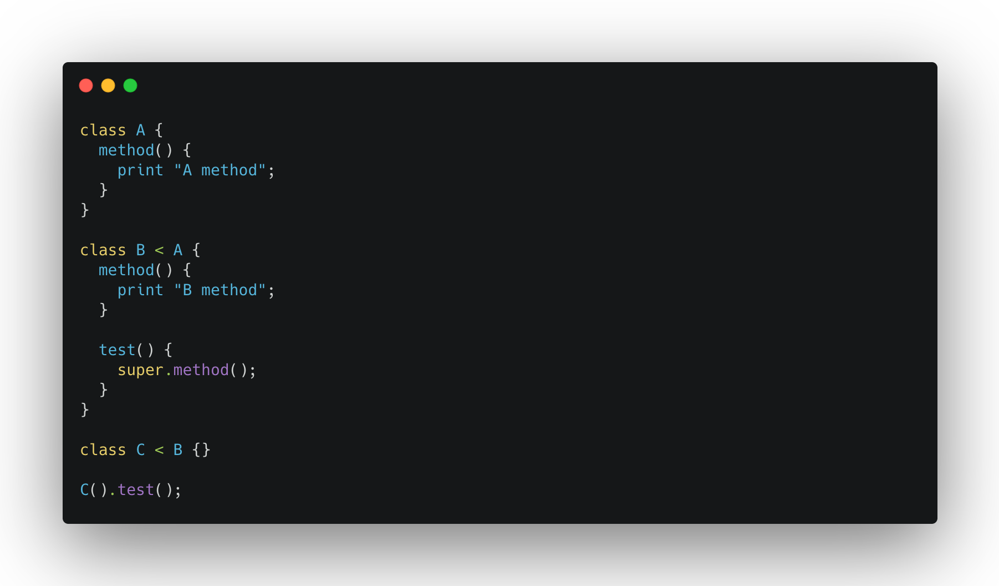

# What

dynamic programming language and tree-walk interpreter, written in Rust based on Lox Language.

# Rules

```

expression → literal
           | unary
           | binary
           | grouping ;

literal    → NUMBER | STRING | "true" | "false" | "nil" ;
grouping   → "(" expression ")" ;
unary      → ( "-" | "!" ) expression ;
binary     → expression operator expression ;
operator   → "==" | "!=" | "<" | "<=" | ">" | ">="
           | "+"  | "-"  | "*" | "/" ;


---------------------------------

program     → declaration* EOF ;

declaration → class_declaration
            | function_declaration
            | var_declaration
            | statement ;

class_declaration → "class" IDENTIFIER ( "<" IDENTIFIER )?
            "{" function* "}" ;

function_declaration  → "fun" function ;
function → IDENTIFIER "(" parameters? ")" block ;
parameters → IDENTIFIER ( "," IDENTIFIER )* ;

statement  → expression_statement
           | for_statement
           | if_statement
           | print_statement
           | return_statement
           | while_statement
           | block_statement ;

return_statement → "return" expression? ";" ;

for_statement   → "for" "(" ( var_declaration | expression_statement | ";" )
                      expression? ";"
                      expression? ")" statement ;


if_statement    → "if" "(" expression ")" statement ( "else" statement )? ;

expression      → assignment ;
print_statement → "print" expression ";" ;
block           → "{" declaration* "}" ;


assignment → ( call "." )? IDENTIFIER "=" assignment
           | logic_or ;
    
logic_or   → logic_and ( "or" logic_and )* ;
logic_and  → equality ( "and" equality )* ;

equality       → comparison ( ( "!=" | "==" ) comparison )* ;
comparison     → addition ( ( ">" | ">=" | "<" | "<=" ) addition )* ;
addition       → multiplication ( ( "-" | "+" ) multiplication )* ;
multiplication → unary ( ( "/" | "*" ) unary )* ;


unary → ( "!" | "-" ) unary | call ;
call → primary ( "(" arguments? ")" | "." IDENTIFIER )* ;

arguments → expression ( "," expression )* ;    // eg (arg1, arg2) or more args.

primary → "true" | "false" | "nil" | "this"
        | NUMBER | STRING | IDENTIFIER | "(" expression ")"
        | "super" "." IDENTIFIER ;
```