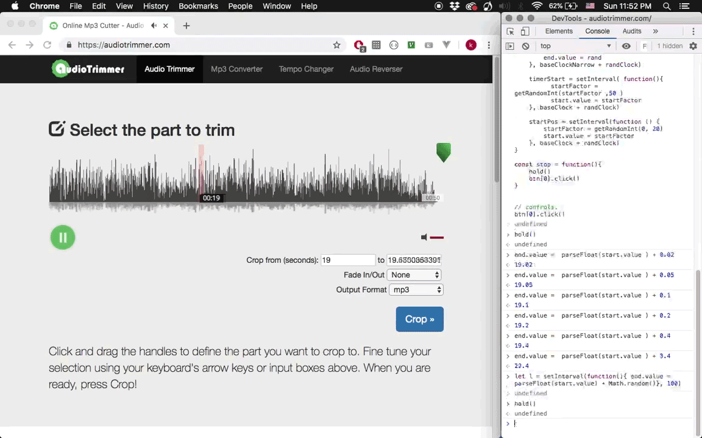

# AudioTrimmer Scripts
#### April, 2019

# What.
Audio Trimmer is an online audio utility, where you can easily trim the audio file . 
an interesting point is start input / end input are two-ways binding.
meaning, we can control current playing position by manipulating start input / end input.
by controlling client-side via console,an interesting (algorithmic) plunderphonic-likes sound can be created.

------
# Learn.

- create new context from existing tool.

