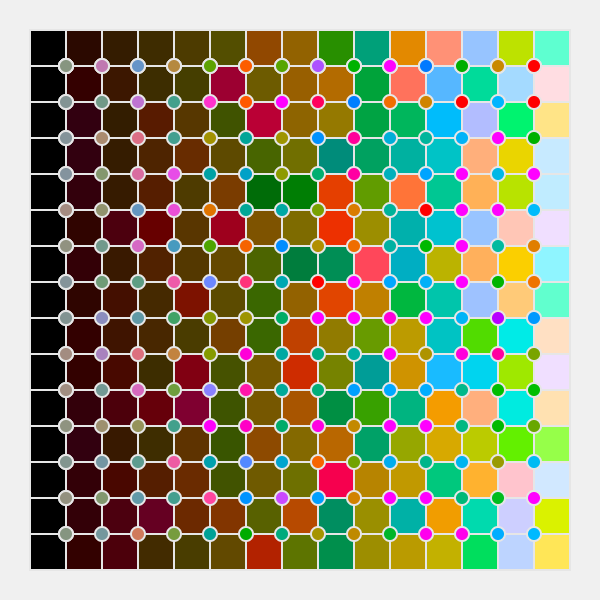

# Programming Design with Rune.js
#### September, 2017

# What.
Graphic was designed by Rune.js, a JavaScript library for programming graphic design systems with SVG.

------

# Why.

coming from graphic design background,personally this library is such a comfortable starting into programming world.

------
# Learn.

- [rune.js](https://runemadsen.github.io/rune.js/).

