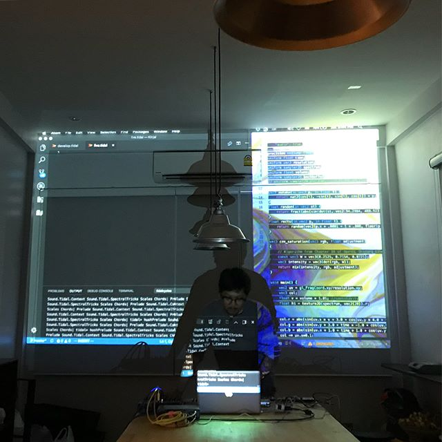

# Karnpapon Boonput ( Jim )

Coming from graphic design field, without any background or familiar with programming language before, it came as a curiosity for promoting his musical project called The ███████ (pronounced as "The Black Codes"). he started learning JavaScript / HTML / CSS from scratch around early 2017. 

web development is required such a steep-learning curve. Not to mention all those bundlers, builders, webpack, git, and other weird noises that adds to the overall complexitiy of learning modern web frameworks. 

surely, learning new thing is hard, but it's challenging at the same time,like learn how to ride a bicycles.
it gives an abilities, going far better than ever thought, see more things. but most importantly, it keeps us hungry, enthusiastic, and never stop to learn new things.

### karnpapon@gmail.com

