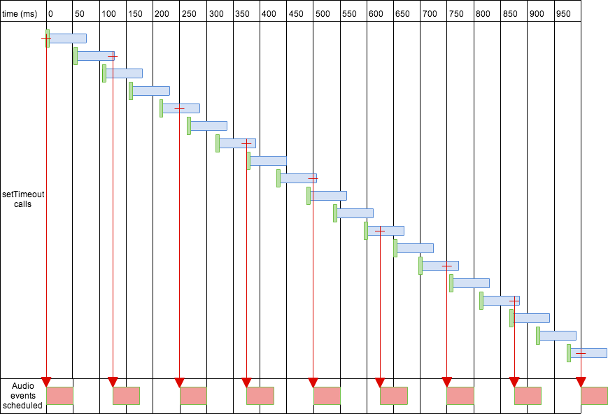
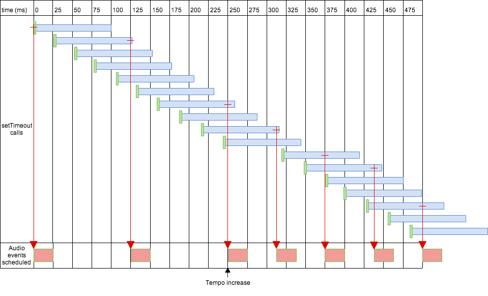
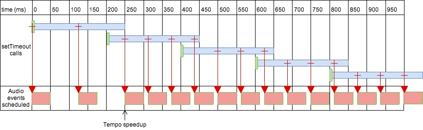

<div class="th-txt">

<div class="intro">
โปรเจค <a href="https://www.karnpapon.me/work/2020/patithin" target="_blank">Patithin</a> เป็นการสร้างเครื่องมือสำหรับการทำงานในแบบ generative art ( หาเรื่องลองหัดเขียน TypeScript ไปด้วย) เอาเข้าจริงคือมันก็ไม่ได้ง่ายอย่างที่คิดไว้ตั้งแต่แรก เพราะจุดสำคัญในการสร้าง sequencer คือจังหวะ หรือความแม่นยำของระยะห่างของเวลา (interval) ด้วยโครงสร้างการทำงานของ JavaScript ทำให้การกำหนด precision timing มีอุปสรรคพอสมควร
</div>


ก่อนอื่นเรามาวิเคราะห์ การ implement เวลาในภาษา JavaScript กันก่อน

# 🕒 เวลาส่วนที่ 1 ( JavaScript Clock )

ในการจัดการเวลาบนเบราเซอร์ เรามักจะใช้ setTimeOut หรือ setInterval ในการกำหนดระยะเวลาในการทำงาน

```
function playBeat2(){
    setTimeOut( function(){
        console.log("tock")
    }, 1000 )
}

function playBeat1(){
    playBeat2()
    setTimeOut( function(){
        console.log("tick")
    }, 2000 )
}

play(){
    playBeat1()
}

// output -> "tock"
// output -> "tick"

```

ด้วยลักษณะการ execute ฟังก์ชั่นในลักษณะของ event-loop แบบนี้ทำให้วิธีนี้ไม่เหมาะกับการทำงานที่ต้องการ precision ของเวลา

# Event loop คืออะไร ?

JavaScript เป็นภาษาที่ทำงานบน single-thread ( หมายถึงรันบน process การทำงานเดียว ) ทำให้เกิดสิ่งที่เรียกว่า blocking I/O หมายถึงการหยุดการทำงานของส่วนอื่นจนกว่าฟังก์ชั่นที่กำลังทำงานอยู่จะทำงานเสร็จก่อน ซึ่ง JavaScript มีวิธีการแก้ปัญหาด้วยการบอกให้ฟังก์ชั่นนั้นทำงานไปก่อน หากเสร็จเมื่อไรแล้วค่อยส่งสัญญาณบอกอีกที ทำให้ระบบการทำงาน "ดูเหมือน" จะทำงานได้หลายอย่างพร้อมๆกัน (Asynchronous) แต่ในความเป็นจริง JavaScript ก็ยังทำงานได้ทีละอย่างอยู่ดี (ต่างจากในภาษา Low-level ที่สามารถรัน parallel ได้อย่างเช่น C++, Rust เป็นต้น) ในการรันฟังก์ชั่นใดๆก็ตาม 
<br/>
<br/>
ในการทำงาน ขั้นแรก JavaScript จะส่งฟังก์ชั่นไปที่ call stack ก่อน ( ฟังก์ชั่นไหนที่ถูกส่งเข้าไปทีหลังจะถูกรันก่อน หรือที่เรียกว่า LIFO, last in first out ) หากมีฟังก์ชั่นที่ต้องใช้เวลาในการรัน (เช่น ajax ) จะถูกส่งไปไว้ใน event table หลังจากนั้นจะส่งไปยัง event queue และเมื่อ call stack ว่างก็จะย้ายจาก event queue ไปรันที่ call stack ทำอย่างนี้ซ้ำไปเรื่อยๆ ( เพราะงั้นถึงเรียกว่า event-loop ) <a href="https://dev.to/lydiahallie/javascript-visualized-event-loop-3dif" target="_blank"> [ อ่านเพิ่ม ]</a>

# " พูดง่ายๆก็คือ setTimeOut() จะไม่การันตีว่ามันจะถูกรันตามที่เรากำหนดเวลาไว้แบบเป๊ะๆ คืออาจคลาดเคลื่อนเล็กน้อย เพราะต้องรอจนกว่า call stack ว่างก่อนถึงจะรันได้ " 

ถ้าเป็นการทำงานทั่วไปก็อาจจะไม่ได้มีปัญหาอะไรมาก แต่ในกรณีที่ต้องการ precision ของเวลา อย่างเช่นการสร้าง metronome (อุปกรณ์กำหนดจังหวะของดนตรี) 

สิ่งที่จะเกิดขึ้นถ้าเราใช้ setInterval เช่นเราลากย่อ หรือขยาย browser กลับไปกลับมา หรือ scroll หน้าเพจขึ้นลงก็คือ interval จะไม่สม่ำเสมอเพราะ event-loop ต้องรอคิวและการคลาดเคลื่อนของเวลาเพียงเล็กน้อย ( ประมาณ > 10ms) ประสาทสัมผัสมนุษย์ก็สามารถสังเกตุได้ ทำให้เกิดสิ่งที่เรียกว่า jittery คือการที่ interval ของเวลาไม่สม่ำเสมอ

นั่นทำให้เรามองหาเวลาที่แม่นยำขึ้นซึ่งใน Web Audio API มันมีคุณสมบัตินี้อยู่

# 🕒 เวลาส่วนที่ 2 ( Web Audio Clock )

ในภาษา JavaScript เราสามารถจัดการ audio event ด้วย Web Audio API ซึ่งไอ้เจ้า web audio เนี่ยจะมี property ที่ชื่อ currentTime ที่สามารถเข้าถึง audio subsystem’s hardware clock ได้ และมีความแม่นยำสูง ( คือทำงานในระดับ sample level ) ซึ่งเป็น floating point ที่ละเอียดระดับจุดทศนิยม 15 หลัก ( double ) ตัวอย่างการใช้งานด้านล่างนี้เลย

```

window.AudioContext = window.AudioContext || window.webkitAudioContext;
var context = new AudioContext();

function playSound(buffer) {
  var source = context.createBufferSource(); 
  source.buffer = buffer;                    
  source.connect(context.destination);       
  source.start(0);                           
}

for (var bar = 0; bar < 2; bar++) {
  var time = startTime + bar * 8 * eighthNoteTime;

  for (var i = 0; i < 8; ++i) {
    playSound(hihat, time + i * eighthNoteTime);
  }
}
```

จากตัวอย่างข้างบนเป็นการเล่น 8th note ( ใน 1 ห้อง (bar) มี 8 จังหวะ )
ดูเผินๆฟังก์ชั่นนี้ทำงานได้ปกติดีนี่นา งั้นปัญหาคืออะไรอ่ะ? 
<br/>

สมมติถ้าเราจะเปลี่ยนความเร็ว/ช้า กลางคัน หรือหยุดในขณะที่อยู่ที่ระหว่าง bar ที่ 1 และ bar ที่ 2 ด้วยการเขียนฟังก์ชั่นแบบนี้จะไม่สามารถทำได้ คือพูดง่ายๆคือมันไม่ยืดหยุ่นในการปรับแก้ไขการทำงานนั่นเอง


# 💡Solution 

ในฝั่ง browser ( main execution thread ) นั้นมีนาฬิกา 1 เรือน ( setTimeOut ) ส่วน audio event เรารู้แล้วว่ามีความแม่นยำกว่ามาก ในเรื่องของเวลา แต่ audio event นั้นรันแยกต่างหากออกจาก main execution thread  

สิ่งที่เราต้องทำก็แค่ทำการเชื่อมนาฬิกาจากฝั่ง audio event มายังฝั่ง main execution thread ด้วย workers 
<a href="https://github.com/cwilso/metronome/blob/master/js/metronomeworker.js" target="_blank">ดูวิธีส่ง msg ด้วย workers ที่นี่</a>

หลังจากที่เราเชื่อมเสร็จแล้ว เรามาดูวิธีกำหนด event ว่าจะทำยังไงได้บ้างด้านล่างนี้เลย


^ สีเขียว = function เริ่มทำงาน ส่วนที่เป็นแถบสีฟ้าคือระยะเวลาในการคอยดูคิวการทำงานของแต่ละ interval ( ในที่นี้คือทุกๆ 50ms ) คือไม่ใช่แค่ดูว่ากำลังรันอะไรอยู่ แต่รวมไปถึงว่าจะรันอะไรต่อไปด้วย เช่นการจะเพิ่มความเร็วก็ต้องคอยดูว่าต่อไปจะต้องเปลี่ยนค่าเป็นเท่าไร จะสังเกตุได้ว่าในความเป็นจริงต่อให้เราเชื่อม setTimeOut เข้ากับ audio event ( audio clock ) ได้แล้ว ก็ยังมีความคลาดเคลื่อนอยู่ดี(ส่วนหนึ่งเป็นเรื่องของความแตกต่างกันไปในแต่ละ hardware ด้วย แต่ก็ยังดีกว่าใช้ setTimeOut เดี่ยวๆอยู่มาก)


^ หรืออาจจะลองกำหนดให้ระยะเวลาดูคิวการทำงานยาวขึ้น( lookahead ) แต่ระยะห่างของแต่ละการ interval สั้นลง ( เหลือ 25ms ) สิ่งที่เกิดขึ้นคือ lookahead จะ overlap กันถ้าจะเปลี่ยนความเร็ว tempo ( interval ) ก็ต้องรอนานขึ้นกว่า tempo จะเปลี่ยน ( เพราะ lookahead ยาว )


^ แบบ lookahead ยาว และ interval ยาว แต่ audio event อื่นๆ(ถ้ามี) ก็จะถูกรันด้วยซึ่งอาจจะเป็นสิ่งไม่พึงประสงค์ในบางกรณี แต่ในกรณีของ metronome เป็น one-note-at-a-time application ก็ไม่ได้เป็นอุปสรรคอะไรมาก

core function ของการเข้าคิวการทำงาน ( scheduling process )
```
while (nextNoteTime < audioContext.currentTime + scheduleAheadTime ) {
  scheduleNote( current16thNote, nextNoteTime );
  nextNote();
}
```

ด้านล่างเอาไว้กำหนดว่า note จะเล่นจะเป็น note อะไร 

```
currentNoteStartTime = time;

// create an oscillator
var osc = audioContext.createOscillator();
osc.connect( audioContext.destination );

if (! (beatNumber % 16) )         // beat 0 == low pitch
  osc.frequency.value = 220.0;
else if (beatNumber % 4)          // quarter notes = medium pitch
  osc.frequency.value = 440.0;
else                              // other 16th notes = high pitch
  osc.frequency.value = 880.0;
osc.start( time );
osc.stop( time + noteLength );
```


ด้านล่างจะเป็นตัวกำหนดล่วงหน้าว่า note ต่อไปจะเป็นอะไร

```
function nextNote() {
  // Advance current note and time by a 16th note...
  var secondsPerBeat = 60.0 / tempo;	// picks up the CURRENT tempo value!
  nextNoteTime += 0.25 * secondsPerBeat;	// Add 1/4 of quarter-note beat length to time

  current16thNote++;	// Advance the beat number, wrap to zero
  if (current16thNote == 16) {
    current16thNote = 0;
  }
}
```

ค่อนข้างซับซ้อนพอสมควรแต่ก็ช่วยแก้ปัญหาเรื่อง jittery ไปได้เยอะทีเดียว ในทางปฏิบัติแล้วในท้ายที่สุดก็ต้องมาลองปรับๆหาจุดที่ลงตัวเอาอยู่ดี เพียงแต่ไอเดียคือการหาจุดที่เหมาะสมของการ "คอยดูคิวล่วงหน้า ( Schedule ahead )" คือไม่ให้ระยะเวลามันสั้นหรือยาวเกินไปจนมีผลต่อความคลาดเคลื่อน ( Delay ) ในการปรับพารามิเตอร์แต่ละที อาจจะเริ่มจาก lookahead ซัก 100ms และ interval ประมาณ 25ms ก็เป็นเรทที่ค่อนข้างเหมาะ

🔥 🔥 🔥 <a href="https://github.com/cwilso/metronome/blob/master/js/metronome.js" target="_blank"> ดูโค้ดเต็มๆ </a> 🔥 🔥 🔥

---


### References
- [A Tale of Two Clocks](https://www.html5rocks.com/en/tutorials/audio/scheduling/)
- [Event-loop](https://dev.to/lydiahallie/javascript-visualized-event-loop-3dif)

### Thanks
visual และโค้ดบางส่วนได้ไอเดียมาจากโปรเจคของน้อง Phoomparin ที่ชื่อ git-garden (https://github.com/phoomparin/git-garden)

</div>
